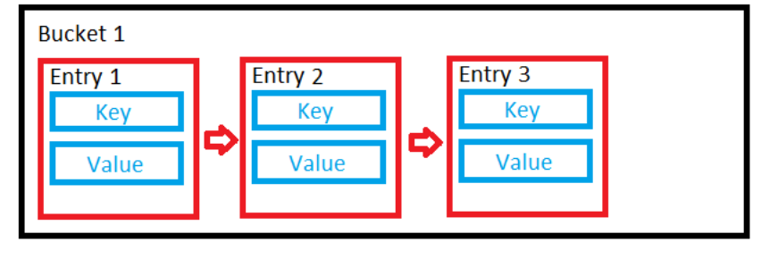
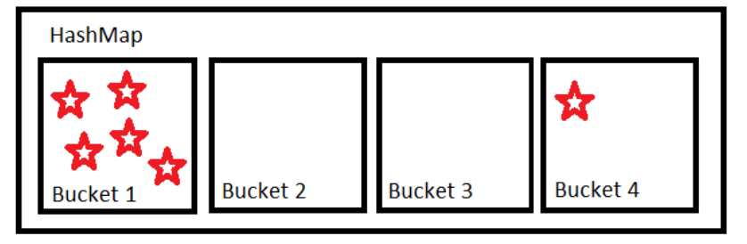
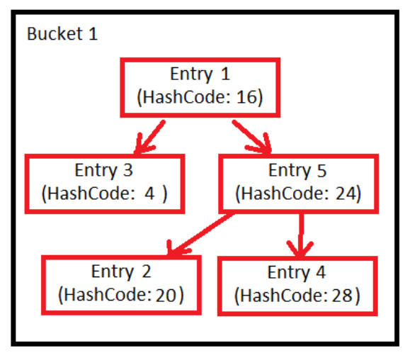

### what is changes in the map in the java 8 version of the java ?

There are some performance changes in the hashmap is done in java 8.

As we know that the hashmap is uses the array and linked list data structure to store the element.

So, when element is adding into the map ot calculates the hash by hashcode and identify the bucket from the array and store the data in linked list manner.

As there will be chances of having the same hashcode for the one value so that all values will be store in linked list manner.
This can be occurred due to the incorrect hascode implementation which is not evenly distribute the values in the map buckets. And which reduces the retriving time for the values from o(1) to o(n).


This performance has been improved in java 8. Once the linked list of the bucket is reaches to the threshold value then the values from the bucket will be stored in the tree manner.
which will be reducing time for this from o(n) to the o(log(n))


---

### What is the return type of the put method from map

put method is returning the exsting value from the map if alereadt exist. Otherwise it will be return the null value.

```
Map<String,String> map = new HashMap<>();
String value  = map.put("any" , "value");
System.out.println(value) // null

value  = map.put("any" , "value2");
System.out.println(value) // value  --> old value
```

---

### What is the difference between the perm gen memory and metaspace memory

Earlier of java 8 is using the perm gen memory to store the meta information of the application such as the class definition , method and field information.

In the java 8 perm gen memory is get replaced with the metaspace memory. were the perm gen memory earlier was an part of the heap memory, and it is an constant size of the memory. Also, earlier there was an not an concept of the loading the classes at the runtime. so when the initially classes are loaded this meta information keeps in the perm gen memort unitl the jvm shutdowns. and now days we can load and unload the classes dynamically due to this there are the chances to get the outOfMemoryError.

This limitation is resolved in the metaspace memory. the task/ask for this memory is the same as the perm gen to store the app meta information.
But now metaspace is not part of the heam it is an native memory which is comuptated in the OS memory. Also this memory can be increased dynamically so the problem of having the OutOfMemory will be reduced here.

Also, same the perm gen GC will be executed on the metaspace memory as well once it will be reaches to the specific threshold.

---

### what is the difference between ClassNotFoundException And NoClassDefFoundError

#### ClassNotFoundException

Is checked exception which needs to be caught and provide the handling.
Basically thrown when the jvm not found the specific class at the runtime. These scenarios mainly this exception is occurred when you are trying to load the class dynamically by reflection like classforNmae() etc.

#### NoClassDefFoundError

Is Error where we don;t need to provide the handling by catch block.
This error can be occurred when the specific definition of the class is not present at the runtime, but it can be present at the compile time.

---

### what is the return type for the list and set add method.

add method from the list and set will be boolean value which tells that specific element is sucessfully added in the list or set.
In case of the set as it will be storing the unique value so if you tried to store the element which is already exist then it will be return the result as false.

```
Set<String> sets =  new HashSet<>();
System.out.println(sets.add("suraj")); // true
System.out.println(sets.add("suraj")); // false
```

---

### what is the use of the hashcode and equals methods ? What is rules and relationship between them ? When to implement this methods ?

1. hashcode and euals -> object methods
2. mainly used when dealing with the hash table collection/mechanisam such as map and hastables
3. hashcode - int representation of the object - alwyas provide the same value on every execution. - there might be an hash code of the two object are same but not neccessory that they are equals - if hashcode is not implemented then when we try to put the object in map then it will be stored in the new location always and when we try to get with creation of same then will give an null value as it calculates the hascode to identify the bucket. - if we not impmlemented the hashcode correctly then it will be slow the map oprations as might be stored the all values in thr single bucket to have to be iterate over all the element from linked list from the bucket.
4. equals - this for equality check of objects. - if both objects are equals then the hashcode of them should be same. - hashcode will find the bukcet but the equals is used to mactch the objects which are available on the bucket when collision is occured. - if we not implemented the equlas method then the if same hashcode values will be replaced with each other even though they are not equals. - also when you try to get the value by creating same value object then it will be return the null as it equals to find the mactch.
5. best practice - same fileds should be used to calculate the hashcode and equals methos so that it will be in sycn.

---

### Internal implementation of the hashMap ?

---
